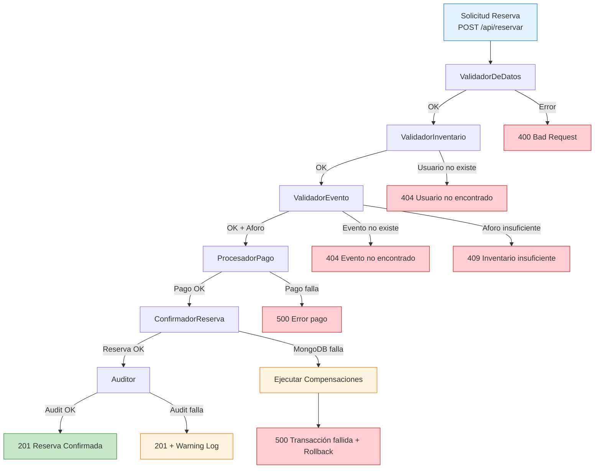

# Chain of Responsibility — Servicio de Reservas y Pagos

## Visión General

El **Servicio de Reservas y Pagos** implementa el patrón **Chain of Responsibility** para estructurar la lógica de validación y procesamiento de la solicitud de reserva. Cada "manejador" (handler) procesa la solicitud y decide si pasa al siguiente o corta la cadena con error.

---

## Diagrama de la Cadena



---

## Estructura de la Cadena (Código)

```python
# reservas-service/src/chain/handler.py
from abc import ABC, abstractmethod
from dataclasses import dataclass
from typing import Optional
from uuid import UUID

@dataclass
class ReservaContext:
    """Contexto que viaja a través de la cadena"""
    usuario_id: UUID
    evento_id: UUID
    cantidad: int
    metodo_pago: str
    reserva_id: UUID
    evento_data: dict = None
    usuario_data: dict = None
    pago_data: dict = None
    reserva_data: dict = None
    error: str = None
    status_code: int = 200

class Handler(ABC):
    """Base abstracta para manejadores de la cadena"""
    
    def __init__(self):
        self._next_handler: Optional[Handler] = None
    
    def set_next(self, handler: 'Handler') -> 'Handler':
        self._next_handler = handler
        return handler
    
    @abstractmethod
    async def handle(self, context: ReservaContext) -> ReservaContext:
        pass
    
    async def _pass_to_next(self, context: ReservaContext) -> ReservaContext:
        if self._next_handler:
            return await self._next_handler.handle(context)
        return context
```

---

## Manejadores Implementados

### 1. ValidadorDeDatos
```python
# reservas-service/src/chain/validators.py
class ValidadorDeDatos(Handler):
    """Valida estructura y tipos de la solicitud"""
    
    async def handle(self, context: ReservaContext) -> ReservaContext:
        # Validar UUIDs
        if not context.usuario_id or not context.evento_id:
            context.error = "usuario_id y evento_id son requeridos"
            context.status_code = 400
            return context
        
        # Validar cantidad
        if context.cantidad <= 0:
            context.error = "La cantidad debe ser mayor a 0"
            context.status_code = 400
            return context
        
        # Validar método de pago
        metodos_validos = ['tarjeta', 'transferencia', 'efectivo', 'mercadopago']
        if context.metodo_pago not in metodos_validos:
            context.error = f"Método de pago inválido. Válidos: {metodos_validos}"
            context.status_code = 400
            return context
        
        return await self._pass_to_next(context)
```

### 2. ValidadorInventario (Usuario)
```python
class ValidadorInventario(Handler):
    """Valida que el usuario existe"""
    
    def __init__(self, usuarios_client):
        super().__init__()
        self.usuarios_client = usuarios_client
    
    async def handle(self, context: ReservaContext) -> ReservaContext:
        usuario = await self.usuarios_client.obtener(context.usuario_id)
        if not usuario:
            context.error = "Usuario no encontrado"
            context.status_code = 404
            return context
        
        context.usuario_data = usuario
        return await self._pass_to_next(context)
```

### 3. ValidadorEvento
```python
class ValidadorEvento(Handler):
    """Valida evento existe y tiene aforo suficiente"""
    
    def __init__(self, eventos_client):
        super().__init__()
        self.eventos_client = eventos_client
    
    async def handle(self, context: ReservaContext) -> ReservaContext:
        evento = await self.eventos_client.obtener(context.evento_id)
        if not evento:
            context.error = "Evento no encontrado"
            context.status_code = 404
            return context
        
        if evento['entradas_disponibles'] < context.cantidad:
            context.error = f"Inventario insuficiente. Disponibles: {evento['entradas_disponibles']}"
            context.status_code = 409
            return context
        
        context.evento_data = evento
        return await self._pass_to_next(context)
```

### 4. ProcesadorPago (Redis Lua Atómico)
```python
class ProcesadorPago(Handler):
    """Procesa pago y decrementa inventario atómicamente en Redis"""
    
    def __init__(self, redis_client):
        super().__init__()
        self.redis = redis_client
        self._lua_script = self._cargar_lua_script()
    
    def _cargar_lua_script(self):
        return self.redis.register_script("""
            -- KEYS[1] = inventario:evento_id
            -- KEYS[2] = pago:reserva_id
            -- ARGV[1] = cantidad, ARGV[2] = reserva_id, ARGV[3] = usuario_id
            -- ARGV[4] = monto, ARGV[5] = metodo_pago
            local disponible = tonumber(redis.call('GET', KEYS[1]) or '0')
            if disponible < tonumber(ARGV[1]) then
                return {0, 'INVENTARIO_INSUFICIENTE'}
            end
            redis.call('DECRBY', KEYS[1], ARGV[1])
            redis.call('HSET', KEYS[2], 
                'reserva_id', ARGV[2], 'usuario_id', ARGV[3],
                'monto', ARGV[4], 'metodo_pago', ARGV[5],
                'estado', 'confirmado', 'timestamp', os.date('!%Y-%m-%dT%H:%M:%SZ')
            )
            redis.call('EXPIRE', KEYS[2], 86400)
            return {1, 'OK'}
        """)
    
    async def handle(self, context: ReservaContext) -> ReservaContext:
        monto = context.evento_data['precio'] * context.cantidad
        inventario_key = f"inventario:{context.evento_id}"
        pago_key = f"pago:{context.reserva_id}"
        
        try:
            result = await self._lua_script(
                keys=[inventario_key, pago_key],
                args=[context.cantidad, str(context.reserva_id), 
                      str(context.usuario_id), monto, context.metodo_pago]
            )
            
            if result[0] == 0:
                context.error = result[1]
                context.status_code = 409 if 'INVENTARIO' in result[1] else 500
                return context
            
            context.pago_data = {
                'reserva_id': str(context.reserva_id),
                'monto': monto,
                'metodo_pago': context.metodo_pago,
                'estado': 'confirmado'
            }
            return await self._pass_to_next(context)
            
        except Exception as e:
            context.error = f"Error procesando pago: {str(e)}"
            context.status_code = 500
            return context
```

### 5. ConfirmadorReserva (MongoDB)
```python
class ConfirmadorReserva(Handler):
    """Persiste la reserva en MongoDB"""
    
    def __init__(self, mongo_db):
        super().__init__()
        self.db = mongo_db
    
    async def handle(self, context: ReservaContext) -> ReservaContext:
        from datetime import datetime
        
        reserva_doc = {
            '_id': context.reserva_id,
            'usuario_id': context.usuario_id,
            'evento_id': context.evento_id,
            'cantidad': context.cantidad,
            'metodo_pago': context.metodo_pago,
            'monto_total': context.evento_data['precio'] * context.cantidad,
            'numero_confirmacion': f"CONF-{datetime.utcnow().strftime('%Y%m%d')}-{str(context.reserva_id)[:8]}",
            'estado': 'confirmada',
            'creado_en': datetime.utcnow()
        }
        
        try:
            await self.db.reservas.insert_one(reserva_doc)
            context.reserva_data = reserva_doc
            return await self._pass_to_next(context)
        except Exception as e:
            context.error = f"Error guardando reserva: {str(e)}"
            context.status_code = 500
            # Trigger compensación
            await self._compensar_pago(context)
            return context
    
    async def _compensar_pago(self, context: ReservaContext):
        """Rollback en Redis"""
        await self.redis.eval("""
            redis.call('INCRBY', KEYS[1], ARGV[1])
            redis.call('DEL', KEYS[2])
        """, 2, f"inventario:{context.evento_id}", f"pago:{context.reserva_id}", context.cantidad)
```

### 6. Auditor (PostgreSQL Event Sourcing)
```python
class Auditor(Handler):
    """Registra evento en PostgreSQL para auditoría y Event Sourcing"""
    
    def __init__(self, pg_pool):
        super().__init__()
        self.pg_pool = pg_pool
    
    async def handle(self, context: ReservaContext) -> ReservaContext:
        import json
        from datetime import datetime
        
        event = {
            'event_type': 'SAGA_COMPLETED',
            'aggregate_id': str(context.reserva_id),
            'aggregate_type': 'Reserva',
            'payload': json.dumps({
                'usuario_id': str(context.usuario_id),
                'evento_id': str(context.evento_id),
                'cantidad': context.cantidad,
                'monto': context.pago_data['monto'],
                'numero_confirmacion': context.reserva_data['numero_confirmacion']
            }),
            'metadata': json.dumps({
                'metodo_pago': context.metodo_pago,
                'service': 'reservas-service'
            }),
            'timestamp': datetime.utcnow()
        }
        
        try:
            async with self.pg_pool.acquire() as conn:
                await conn.execute("""
                    INSERT INTO event_log (event_type, aggregate_id, aggregate_type, payload, metadata, timestamp)
                    VALUES ($1, $2, $3, $4, $5, $6)
                """, event['event_type'], event['aggregate_id'], event['aggregate_type'],
                     event['payload'], event['metadata'], event['timestamp'])
            return await self._pass_to_next(context)
        except Exception as e:
            # No fallar la reserva por auditoría
            import logging
            logging.warning(f"Auditoría falló para reserva {context.reserva_id}: {e}")
            return await self._pass_to_next(context)
```

---

## Construcción de la Cadena (Main)

```python
# reservas-service/src/main.py (fragmento)
from chain.handler import ReservaContext
from chain.validators import (
    ValidadorDeDatos, ValidadorInventario, ValidadorEvento,
    ProcesadorPago, ConfirmadorReserva, Auditor
)

def construir_cadena_reserva(usuarios_client, eventos_client, redis_client, mongo_db, pg_pool):
    """Construye y retorna el primer handler de la cadena"""
    
    h1 = ValidadorDeDatos()
    h2 = ValidadorInventario(usuarios_client)
    h3 = ValidadorEvento(eventos_client)
    h4 = ProcesadorPago(redis_client)
    h5 = ConfirmadorReserva(mongo_db)
    h6 = Auditor(pg_pool)
    
    # Encadenar
    h1.set_next(h2).set_next(h3).set_next(h4).set_next(h5).set_next(h6)
    
    return h1

@app.post("/api/reservar", response_model=ReservaResponse, status_code=201)
async def reservar(solicitud: ReservaRequest):
    reserva_id = uuid4()
    context = ReservaContext(
        usuario_id=solicitud.usuario_id,
        evento_id=solicitud.evento_id,
        cantidad=solicitud.cantidad,
        metodo_pago=solicitud.metodo_pago,
        reserva_id=reserva_id
    )
    
    # Ejecutar cadena
    chain = construir_cadena_reserva(usuarios_client, eventos_client, redis_client, mongodb, pg_pool)
    result = await chain.handle(context)
    
    if result.error:
        raise HTTPException(status_code=result.status_code, detail=result.error)
    
    return ReservaResponse(
        reserva_id=str(result.reserva_id),
        estado=result.reserva_data['estado'],
        numero_confirmacion=result.reserva_data['numero_confirmacion']
    )
```

---

## Ventajas de Esta Implementación

| Beneficio | Descripción |
|-----------|-------------|
| **Separación de responsabilidades** | Cada handler hace una sola cosa |
| **Testabilidad** | Cada handler se prueba independientemente |
| **Extensibilidad** | Agregar validaciones = nuevo handler en la cadena |
| **Orden garantizado** | La cadena define secuencia explícita |
| **Compensación natural** | Fallo en handler N → compensar handlers N-1...4 |
| **Observabilidad** | Cada paso logueado en PostgreSQL |