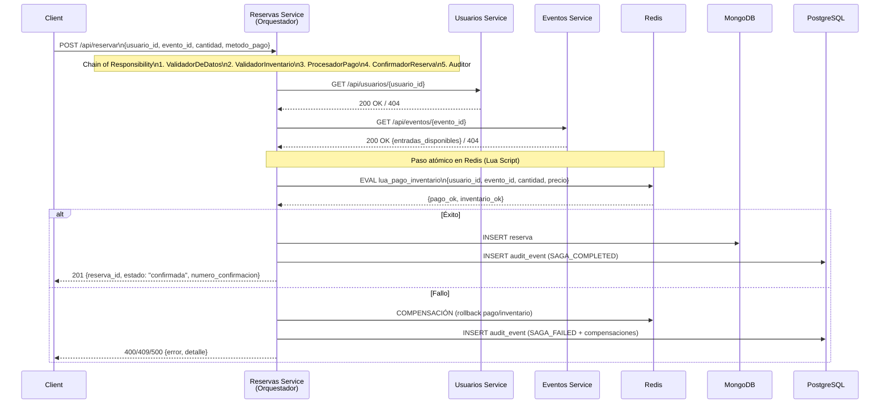
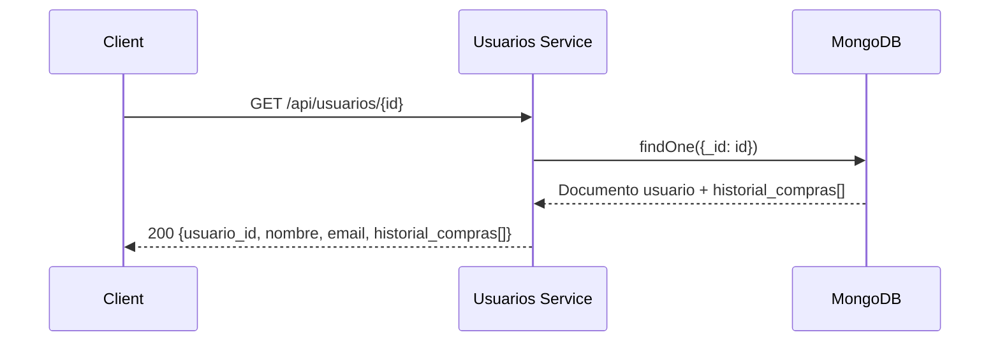
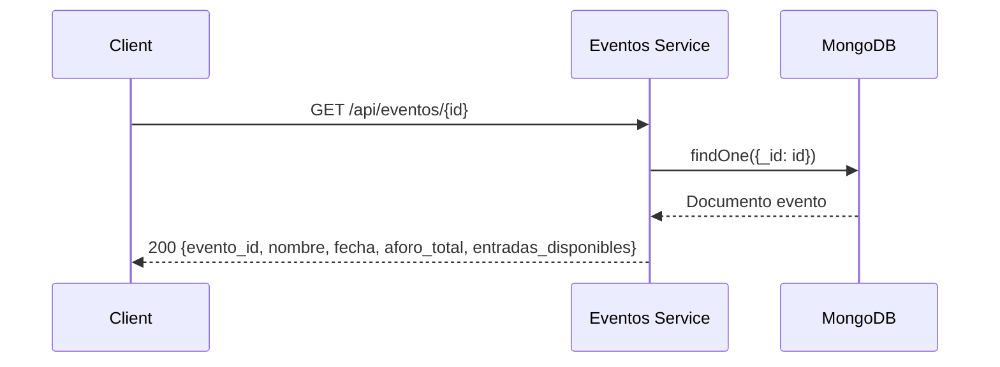
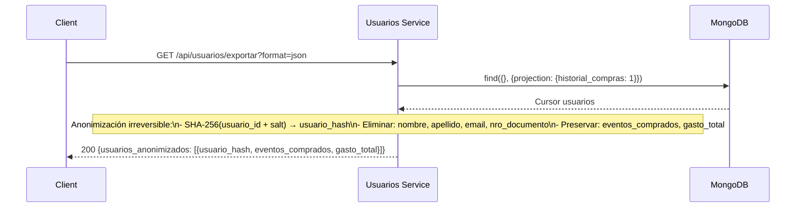
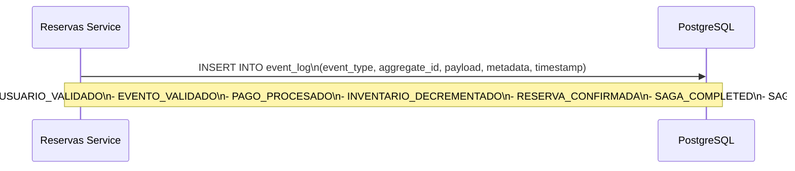

# Flujo de Datos — EventFlow

## Flujo Principal: Compra de Entrada (SAGA)

---

## Flujo: Lectura de Usuario

---

## Flujo: Lectura de Evento

---

## Flujo: Exportación Anonimizada (GDPR)

---

## Flujo: Escritura de Evento (Audit Log)

---

## Resumen de Flujos por Consistencia

| Flujo | Consistencia | Latencia Objetivo | Patrón |
|-------|--------------|-------------------|--------|
| Lectura Usuario | Eventual | < 50ms | Direct MongoDB |
| Lectura Evento | Eventual | < 50ms | Direct MongoDB |
| Listar Usuarios | Eventual | < 100ms | Paginado MongoDB |
| Compra Entrada | **Fuerte** | < 500ms | SAGA + Redis Lua |
| Exportar Anonimizado | Eventual | < 2s | Batch + Hash |

---

## Datos que Fluyen Entre Servicios

| Origen → Destino | Datos | Frecuencia |
|------------------|-------|------------|
| Reservas → Usuarios | `usuario_id` (validación) | Por reserva |
| Reservas → Eventos | `evento_id`, `cantidad` (validación + decremento) | Por reserva |
| Reservas → Redis | `pago_data`, `inventario_delta` | Por reserva (atómico) |
| Reservas → MongoDB | `reserva_document` | Por reserva exitosa |
| Reservas → PostgreSQL | `audit_event` | Por paso SAGA |

---

## Consideraciones de Rendimiento

1. **Lecturas paralelas**: Usuarios y Eventos se validan en paralelo en SAGA
2. **Redis Lua**: Pago + inventario en una sola operación atómica (single round-trip)
3. **Índices MongoDB**: 
   - `usuarios`: `_id`, `email` (unique), `nro_documento` (unique)
   - `eventos`: `_id`, `fecha`
   - `reservas`: `usuario_id`, `evento_id`, `estado`
4. **Connection pooling**: httpx.AsyncClient con límites