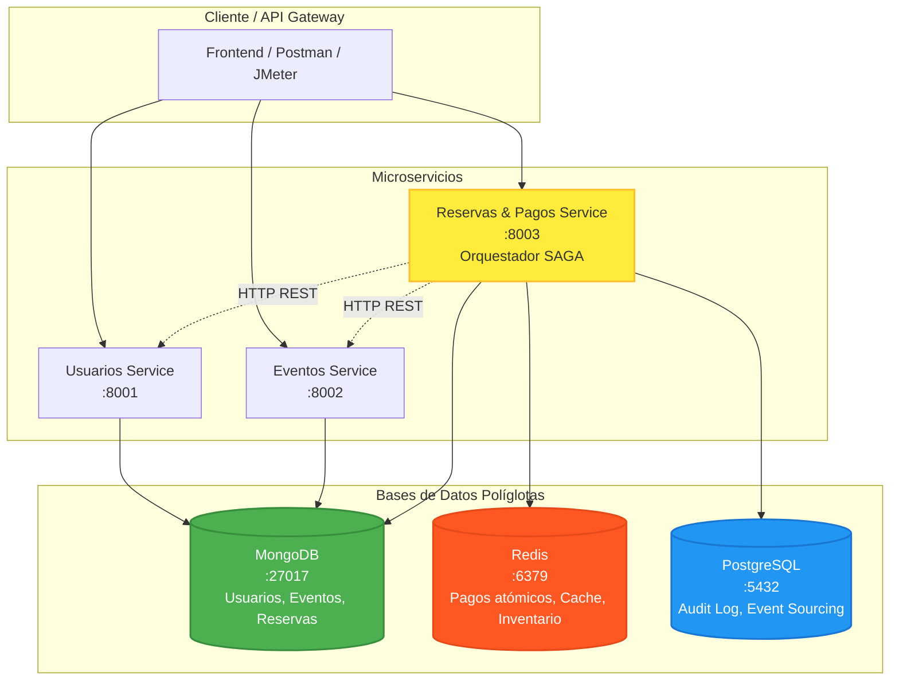

# Diagrama de Microservicios — EventFlow

## Topología de Servicios



---

## Descripción de Interacciones

### 1. Cliente → Servicios (Directo)
- **GET /api/usuarios/{id}** → Usuarios Service → MongoDB
- **GET /api/eventos/{id}** → Eventos Service → MongoDB
- **POST /api/reservar** → Reservas Service (Orquestador)

### 2. Reservas Service → Otros Servicios (Orquestación SAGA)
```
POST /api/reservar
    │
    ├─► GET /api/usuarios/{usuario_id}     (Validar usuario existe)
    │
    ├─► GET /api/eventos/{evento_id}       (Validar evento + aforo)
    │
    ├─► Redis: Lua Script (Pago atómico + Decremento inventario)
    │
    ├─► MongoDB: Insert Reserva
    │
    └─► PostgreSQL: Insert Audit Event
```

### 3. Flujos de Datos por Base de Datos

| Base de Datos | Escritura | Lectura |
|---------------|-----------|---------|
| **MongoDB** | Usuarios, Eventos, Reservas | Usuarios, Eventos, Historial |
| **Redis** | Pago (Lua), Inventario temporal | Cache disponibilidad |
| **PostgreSQL** | Audit log (Event Sourcing) | Reportes, Compliance |

---

## Puertos y Health Checks

| Servicio | Puerto | Health Endpoint |
|----------|--------|-----------------|
| Usuarios | 8001 | GET /health |
| Eventos | 8002 | GET /health |
| Reservas | 8003 | GET /health |
| MongoDB | 27017 | `db.runCommand({ping:1})` |
| Redis | 6379 | `redis-cli ping` |
| PostgreSQL | 5432 | `pg_isready` |

---

## Red Docker

```yaml
networks:
  eventflow_network:
    driver: bridge
```

Todos los servicios comparten la red `eventflow_network` para comunicación interna por nombre de servicio.

---

## Volúmenes Persistentes

```yaml
volumes:
  mongodb_data:    # Datos MongoDB
  redis_data:      # Datos Redis (AOF)
  postgresql_data: # Datos PostgreSQL
```