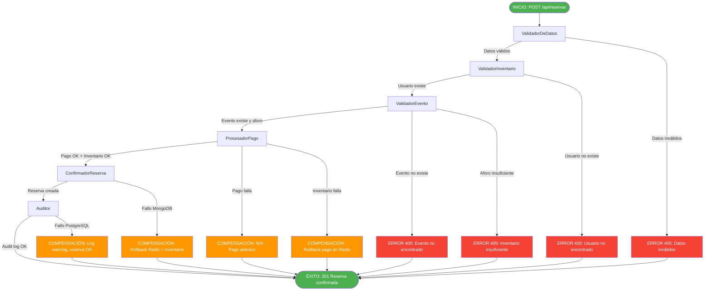
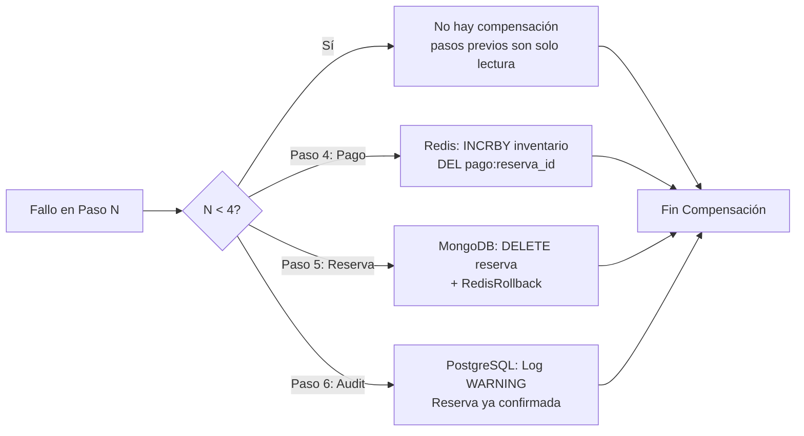

# Flujo SAGA — Compra de Entradas EventFlow

## Visión General

El **Servicio de Reservas y Pagos** actúa como **Orquestador Central** del patrón SAGA con orquestación. Coordina la transacción distribuida de compra de entradas garantizando atomicidad mediante compensaciones.

---

## Diagrama de Flujo SAGA



---

## Pasos de la Transacción Exitosa

| Paso | Handler | Acción | Servicio/BD | Rollback si falla |
|------|---------|--------|-------------|-------------------|
| 1 | **ValidadorDeDatos** | Validar esquema request (UUIDs, cantidad > 0, método pago válido) | Local | N/A |
| 2 | **ValidadorInventario** | GET `/api/usuarios/{id}` — Verificar usuario existe | Usuarios Service | N/A |
| 3 | **ValidadorEvento** | GET `/api/eventos/{id}` — Verificar evento existe + `entradas_disponibles >= cantidad` | Eventos Service | N/A |
| 4 | **ProcesadorPago** | **Lua Script Redis** atómico: `DECRBY inventario:evento_id cantidad` + `SET pago:reserva_id {data}` | Redis | `INCRBY inventario` + `DEL pago` |
| 5 | **ConfirmadorReserva** | INSERT en MongoDB colección `reservas` | MongoDB | `DELETE reserva` + compensación Redis |
| 6 | **Auditor** | INSERT en PostgreSQL `event_log` (SAGA_COMPLETED) | PostgreSQL | Log warning (no bloquea) |

---

## Transacciones de Compensación (Rollback)



### Detalle de Compensaciones

| Fallo en | Acción de Compensación | Implementación |
|----------|------------------------|----------------|
| **Paso 4 (Pago/Inventario)** | Rollback automático en Lua script (transacción atómica) | El script Lua verifica y hace rollback internamente |
| **Paso 5 (MongoDB Reserva)** | 1. DELETE reserva en MongoDB<br>2. Ejecutar Lua compensación en Redis | `compensar_pago_inventario(evento_id, cantidad, reserva_id)` |
| **Paso 6 (PostgreSQL Audit)** | Solo log de warning — la reserva ya está confirmada | No bloquea, alerta para reconciliación manual |

---

## Lua Script: Pago Atómico + Inventario

```lua
-- KEYS[1] = inventario:evento_id
-- KEYS[2] = pago:reserva_id
-- ARGV[1] = cantidad
-- ARGV[2] = reserva_id
-- ARGV[3] = usuario_id
-- ARGV[4] = monto
-- ARGV[5] = metodo_pago

local inventario_key = KEYS[1]
local pago_key = KEYS[2]
local cantidad = tonumber(ARGV[1])
local reserva_id = ARGV[2]
local usuario_id = ARGV[3]
local monto = ARGV[4]
local metodo_pago = ARGV[5]

-- Verificar inventario disponible
local disponible = tonumber(redis.call('GET', inventario_key) or '0')
if disponible < cantidad then
    return {0, 'INVENTARIO_INSUFICIENTE'}
end

-- Transacción atómica: decrementar inventario + crear pago
redis.call('DECRBY', inventario_key, cantidad)
redis.call('HSET', pago_key, 
    'reserva_id', reserva_id,
    'usuario_id', usuario_id,
    'monto', monto,
    'metodo_pago', metodo_pago,
    'estado', 'confirmado',
    'timestamp', os.date('!%Y-%m-%dT%H:%M:%SZ')
)
redis.call('EXPIRE', pago_key, 86400) -- 24h TTL

return {1, 'OK'}
```

---

## Lua Script: Compensación (Rollback)

```lua
-- KEYS[1] = inventario:evento_id
-- KEYS[2] = pago:reserva_id

local inventario_key = KEYS[1]
local pago_key = KEYS[2]

-- Restaurar inventario
redis.call('INCRBY', inventario_key, 1) -- cantidad se pasa como ARGV si necesario

-- Eliminar registro de pago
redis.call('DEL', pago_key)

return {1, 'COMPENSACION_OK'}
```

---

## Estados de la SAGA

| Estado | Descripción | Próximo Paso Posible |
|--------|-------------|---------------------|
| `STARTED` | SAGA iniciada | ValidadorDeDatos |
| `USUARIO_VALIDADO` | Usuario existe | ValidadorEvento |
| `EVENTO_VALIDADO` | Evento existe + aforo | ProcesadorPago |
| `PAGO_PROCESADO` | Pago + inventario OK en Redis | ConfirmadorReserva |
| `RESERVA_CONFIRMADA` | Reserva en MongoDB | Auditor |
| `SAGA_COMPLETED` | Todo OK + Audit log | — |
| `SAGA_FAILED` | Fallo + compensaciones ejecutadas | — |
| `COMPENSATING` | Ejecutando rollback | — |

---

## Manejo de Errores por Tipo

| Error | HTTP Status | Compensación | Reintento |
|-------|-------------|--------------|-----------|
| Usuario no encontrado | 404 | Ninguna (solo lectura) | No |
| Evento no encontrado | 404 | Ninguna (solo lectura) | No |
| Inventario insuficiente | 409 | Ninguna (solo lectura) | No (reintentar manual) |
| Pago falla (Redis) | 500 | Automática en Lua | Sí (idempotente) |
| MongoDB falla | 500 | Compensación Redis + MongoDB | Sí |
| PostgreSQL falla | 500 | Log warning only | Sí (reintento async) |

---

## Idempotencia

- **Clave de idempotencia**: `reserva_id` (UUID v4) generado al inicio
- **Redis**: `pago:reserva_id` evita doble procesamiento
- **MongoDB**: `reserva_id` único (índice unique)
- **PostgreSQL**: `event_log` con `aggregate_id = reserva_id` permite detectar duplicados