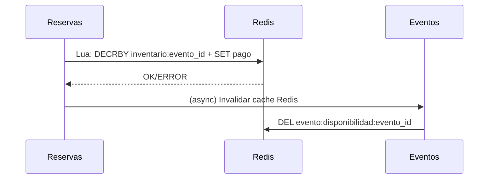

# Servicio de Eventos

## Responsabilidad

Gestiona información de eventos, disponibilidad de entradas (aforo) y consultas de catálogo.

---

## Tecnologías

- **Framework**: FastAPI (Python 3.11)
- **Base de Datos**: MongoDB (colección `eventos`)
- **Cache**: Redis (opcional, para disponibilidad frecuente)
- **Puerto**: 8002
- **Documentación**: http://localhost:8002/docs

---

## Modelo de Datos

### Colección: `eventos`

```json
{
  "_id": "UUID",
  "nombre": "string",
  "descripcion": "string",
  "fecha": "ISODate",
  "ubicacion": {
    "venue": "string",
    "direccion": "string",
    "ciudad": "string",
    "pais": "string"
  },
  "aforo_total": "int",
  "entradas_disponibles": "int",
  "precios": [
    {
      "categoria": "string",
      "precio": "float",
      "disponibles": "int"
    }
  ],
  "categorias": ["string"],
  "estado": "borrador | publicado | cancelado | finalizado",
  "creado_en": "ISODate",
  "actualizado_en": "ISODate"
}
```

### Índices

```javascript
db.eventos.createIndex({ "fecha": 1 })
db.eventos.createIndex({ "estado": 1, "fecha": 1 })
db.eventos.createIndex({ "nombre": "text", "descripcion": "text" })
```

---

## Endpoints

| Método | Ruta | Descripción | Consistencia |
|--------|------|-------------|--------------|
| GET | `/health` | Health check | — |
| POST | `/api/eventos` | Crear evento | Fuerte |
| GET | `/api/eventos/{evento_id}` | Obtener evento + aforo | Eventual |

### Detalle de Endpoints

#### POST /api/eventos
```json
// Request
{
  "nombre": "Concierto Rock 2026",
  "descripcion": "Gran festival de rock",
  "fecha": "2026-12-15T20:00:00Z",
  "ubicacion": {
    "venue": "Estadio Central",
    "direccion": "Av. Principal 123",
    "ciudad": "Madrid",
    "pais": "España"
  },
  "aforo_total": 50000,
  "precios": [
    { "categoria": "VIP", "precio": 200.0, "disponibles": 1000 },
    { "categoria": "General", "precio": 80.0, "disponibles": 30000 },
    { "categoria": "Popular", "precio": 40.0, "disponibles": 19000 }
  ],
  "categorias": ["musica", "rock", "festival"]
}

// Response 201
{
  "evento_id": "550e8400-e29b-41d4-a716-446655440001",
  "nombre": "Concierto Rock 2026",
  "fecha": "2026-12-15T20:00:00Z",
  "aforo_total": 50000,
  "entradas_disponibles": 50000,
  "estado": "borrador"
}
```

#### GET /api/eventos/{evento_id}
```json
// Response 200
{
  "evento_id": "550e8400-e29b-41d4-a716-446655440001",
  "nombre": "Concierto Rock 2026",
  "descripcion": "Gran festival de rock",
  "fecha": "2026-12-15T20:00:00Z",
  "ubicacion": { "venue": "Estadio Central", "ciudad": "Madrid", "pais": "España" },
  "aforo_total": 50000,
  "entradas_disponibles": 48500,
  "precios": [
    { "categoria": "VIP", "precio": 200.0, "disponibles": 950 },
    { "categoria": "General", "precio": 80.0, "disponibles": 29000 },
    { "categoria": "Popular", "precio": 40.0, "disponibles": 18550 }
  ],
  "estado": "publicado"
}
```

---

## Sincronización de Inventario (Redis)

Para alta concurrencia en consulta de disponibilidad:

```python
# Cache en Redis con TTL
async def obtener_disponibilidad(evento_id: UUID):
    # Intentar cache primero
    cached = await redis.get(f"evento:disponibilidad:{evento_id}")
    if cached:
        return int(cached)
    
    # Fallback a MongoDB
    evento = await db.eventos.find_one({"_id": evento_id})
    disponibles = evento["entradas_disponibles"]
    
    # Cache por 30 segundos
    await redis.setex(f"evento:disponibilidad:{evento_id}", 30, disponibles)
    return disponibles
```

**Invalidación**: Al decrementar inventario (SAGA paso 4), `DEL` la clave de cache.

---

## Validaciones

| Campo | Reglas |
|-------|--------|
| `nombre` | Requerido, 1-200 chars |
| `fecha` | ISODate, futura |
| `aforo_total` | Entero > 0 |
| `precios[].categoria` | Único por evento |
| `precios[].precio` | Float >= 0 |
| `precios[].disponibles` | Entero >= 0, suma <= aforo_total |
| `estado` | Enum: borrador, publicado, cancelado, finalizado |

---

## Integración con Reservas Service

### Reservas Service → Eventos Service
- **GET** `/api/eventos/{evento_id}` — Validar existencia + aforo (SAGA paso 3)
- **Consistencia**: Eventual para lectura, Fuerte para decremento (vía Redis Lua)

### Flujo de Decremento de Inventario


---

## Referencias

- [[data-models/event-schema]] — Esquema detallado
- [[endpoints/eventos-endpoints]] — Referencia OpenAPI
- [[architecture/saga-flow]] — Uso en SAGA
- [[decisions/consistency-strategy]] — Consistencia eventual en lecturas