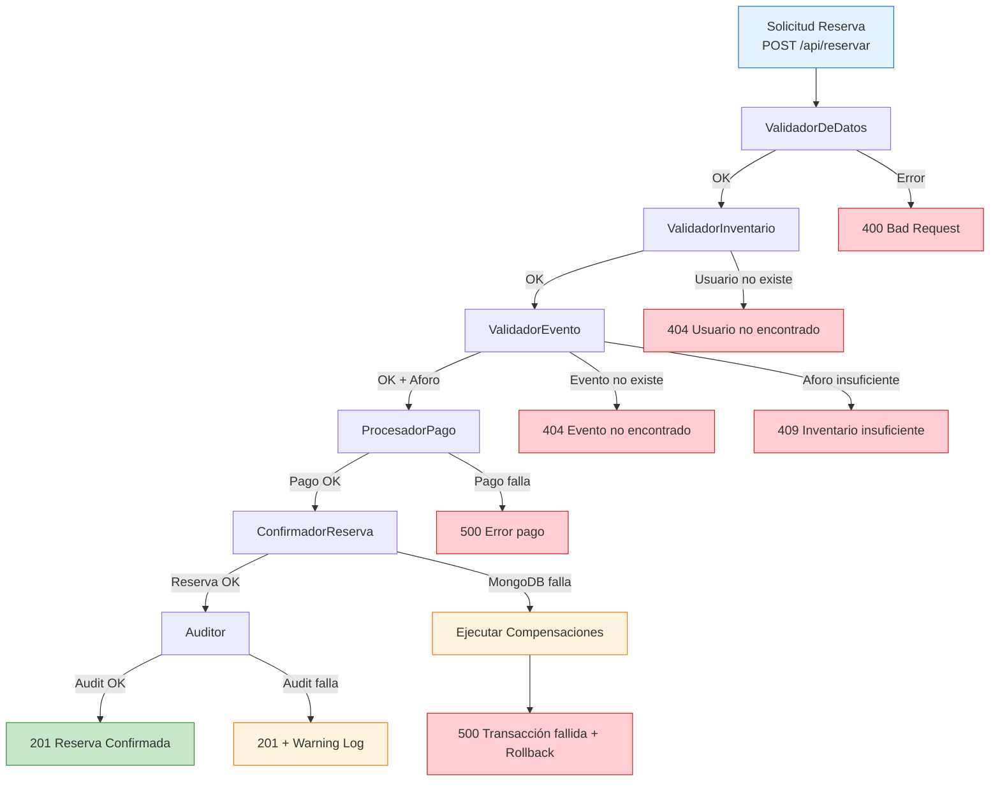

# Chain of Responsibility - Reservas Service

## Visión General

El **Servicio de Reservas y Pagos** implementa el patrón **Chain of Responsibility** para estructurar la lógica de validación y procesamiento de la solicitud de reserva. Cada "manejador" (handler) procesa la solicitud y decide si pasa al siguiente o corta la cadena con error.

---

## Diagrama de la Cadena



---

## Estructura Base (Código)

### Handler Abstracto

```python
# reservas-service/src/chain/handler.py
from abc import ABC, abstractmethod
from dataclasses import dataclass
from typing import Optional
from uuid import UUID

@dataclass
class ReservaContext:
    """Contexto que viaja a través de la cadena - INMUTABLE entre handlers"""
    usuario_id: UUID
    evento_id: UUID
    cantidad: int
    metodo_pago: str
    reserva_id: UUID              # Generado al inicio (idempotencia)
    correlation_id: UUID          # Para tracing distribuido
    evento_data: dict = None      # Llenado por ValidadorEvento
    usuario_data: dict = None     # Llenado por ValidadorInventario
    pago_data: dict = None        # Llenado por ProcesadorPago
    reserva_data: dict = None     # Llenado por ConfirmadorReserva
    error: str = None
    status_code: int = 200

class Handler(ABC):
    """Base abstracta para manejadores de la cadena"""
    
    def __init__(self):
        self._next_handler: Optional['Handler'] = None
    
    def set_next(self, handler: 'Handler') -> 'Handler':
        self._next_handler = handler
        return handler
    
    @abstractmethod
    async def handle(self, context: ReservaContext) -> ReservaContext:
        pass
    
    async def _pass_to_next(self, context: ReservaContext) -> ReservaContext:
        if self._next_handler:
            return await self._next_handler.handle(context)
        return context
```

### Chain Builder

```python
# reservas-service/src/chain/builder.py
from chain.handler import Handler
from chain.validators import (
    ValidadorDeDatos, ValidadorInventario, ValidadorEvento,
    ProcesadorPago, ConfirmadorReserva, Auditor
)
from services.http_clients import UsuariosClient, EventosClient
from services.redis_pago import RedisPago
from services.mongo import get_mongo_db
from services.postgresql import get_pg_pool

def build_reserva_chain() -> Handler:
    """Construye y retorna el primer handler de la cadena completa"""
    
    # Dependencias (injected)
    usuarios_client = UsuariosClient()
    eventos_client = EventosClient()
    redis_pago = RedisPago()
    mongo_db = get_mongo_db()
    pg_pool = get_pg_pool()
    
    # Instanciar handlers
    h1 = ValidadorDeDatos()
    h2 = ValidadorInventario(usuarios_client)
    h3 = ValidadorEvento(eventos_client)
    h4 = ProcesadorPago(redis_pago)
    h5 = ConfirmadorReserva(mongo_db)
    h6 = Auditor(pg_pool)
    
    # Encadenar: h1 → h2 → h3 → h4 → h5 → h6
    h1.set_next(h2).set_next(h3).set_next(h4).set_next(h5).set_next(h6)
    
    return h1
```

---

## 6 Handlers Implementados

### 1. ValidadorDeDatos (Local - Sin I/O)

```python
# reservas-service/src/chain/validators.py
class ValidadorDeDatos(Handler):
    """Valida estructura y tipos de la solicitud"""
    
    METODOS_VALIDOS = ['tarjeta', 'transferencia', 'efectivo', 'mercadopago']
    
    async def handle(self, context: ReservaContext) -> ReservaContext:
        # Validar UUIDs
        if not context.usuario_id or not context.evento_id:
            context.error = "usuario_id y evento_id son requeridos"
            context.status_code = 400
            return context
        
        # Validar cantidad
        if context.cantidad <= 0:
            context.error = "La cantidad debe ser mayor a 0"
            context.status_code = 400
            return context
        
        # Validar método de pago
        if context.metodo_pago not in self.METODOS_VALIDOS:
            context.error = f"Método de pago inválido. Válidos: {self.METODOS_VALIDOS}"
            context.status_code = 400
            return context
        
        return await self._pass_to_next(context)
```

### 2. ValidadorInventario (HTTP → Usuarios Service)

```python
class ValidadorInventario(Handler):
    """Valida que el usuario existe"""
    
    def __init__(self, usuarios_client):
        super().__init__()
        self.usuarios_client = usuarios_client
    
    async def handle(self, context: ReservaContext) -> ReservaContext:
        usuario = await self.usuarios_client.obtener(context.usuario_id)
        if not usuario:
            context.error = "Usuario no encontrado"
            context.status_code = 404
            return context
        
        context.usuario_data = usuario  # Para uso posterior
        return await self._pass_to_next(context)
```

### 3. ValidadorEvento (HTTP → Eventos Service)

```python
class ValidadorEvento(Handler):
    """Valida evento existe y tiene aforo suficiente"""
    
    def __init__(self, eventos_client):
        super().__init__()
        self.eventos_client = eventos_client
    
    async def handle(self, context: ReservaContext) -> ReservaContext:
        evento = await self.eventos_client.obtener(context.evento_id)
        if not evento:
            context.error = "Evento no encontrado"
            context.status_code = 404
            return context
        
        if evento['entradas_disponibles'] < context.cantidad:
            context.error = f"Inventario insuficiente. Disponibles: {evento['entradas_disponibles']}"
            context.status_code = 409
            return context
        
        context.evento_data = evento
        return await self._pass_to_next(context)
```

### 4. ProcesadorPago (Redis Lua Atómico)

```python
class ProcesadorPago(Handler):
    """Procesa pago y decrementa inventario atómicamente en Redis"""
    
    def __init__(self, redis_pago):
        super().__init__()
        self.redis_pago = redis_pago
    
    async def handle(self, context: ReservaContext) -> ReservaContext:
        monto = context.evento_data['precio'] * context.cantidad
        
        try:
            # Ejecuta Lua script atómico: verifica + decrementa + registra pago
            result = await self.redis_pago.pagar_y_decrementar(
                evento_id=context.evento_id,
                reserva_id=context.reserva_id,
                usuario_id=context.usuario_id,
                cantidad=context.cantidad,
                monto=monto,
                metodo_pago=context.metodo_pago
            )
            
            if not result.success:
                context.error = result.error
                context.status_code = 409 if 'INVENTARIO' in result.error else 500
                return context
            
            context.pago_data = {
                'reserva_id': str(context.reserva_id),
                'monto': monto,
                'metodo_pago': context.metodo_pago,
                'estado': 'confirmado'
            }
            return await self._pass_to_next(context)
            
        except Exception as e:
            context.error = f"Error procesando pago: {str(e)}"
            context.status_code = 500
            return context
```

### 5. ConfirmadorReserva (MongoDB + Compensación)

```python
class ConfirmadorReserva(Handler):
    """Persiste la reserva en MongoDB"""
    
    def __init__(self, mongo_db):
        super().__init__()
        self.db = mongo_db
    
    async def handle(self, context: ReservaContext) -> ReservaContext:
        from datetime import datetime
        
        reserva_doc = {
            '_id': context.reserva_id,
            'usuario_id': context.usuario_id,
            'evento_id': context.evento_id,
            'cantidad': context.cantidad,
            'metodo_pago': context.metodo_pago,
            'monto_total': context.evento_data['precio'] * context.cantidad,
            'numero_confirmacion': f"CONF-{datetime.utcnow().strftime('%Y%m%d')}-{str(context.reserva_id)[:8]}",
            'estado': 'confirmada',
            'creado_en': datetime.utcnow(),
            'saga_log': [
                {'paso': 'USUARIO_VALIDADO', 'timestamp': datetime.utcnow(), 'exitoso': True},
                {'paso': 'EVENTO_VALIDADO', 'timestamp': datetime.utcnow(), 'exitoso': True},
                {'paso': 'PAGO_PROCESADO', 'timestamp': datetime.utcnow(), 'exitoso': True},
            ]
        }
        
        try:
            await self.db.reservas.insert_one(reserva_doc)
            context.reserva_data = reserva_doc
            return await self._pass_to_next(context)
        except Exception as e:
            context.error = f"Error guardando reserva: {str(e)}"
            context.status_code = 500
            # COMPENSACIÓN: Rollback Redis
            await self._compensar_pago(context)
            return context
    
    async def _compensar_pago(self, context: ReservaContext):
        """Ejecuta Lua script de compensación en Redis"""
        await self.redis_pago.compensar(
            evento_id=context.evento_id,
            reserva_id=context.reserva_id,
            cantidad=context.cantidad
        )
```

### 6. Auditor (PostgreSQL Event Sourcing)

```python
class Auditor(Handler):
    """Registra evento en PostgreSQL para auditoría y Event Sourcing"""
    
    def __init__(self, pg_pool):
        super().__init__()
        self.pg_pool = pg_pool
    
    async def handle(self, context: ReservaContext) -> ReservaContext:
        import json
        from datetime import datetime
        
        # Registrar TODOS los pasos, no solo el final
        pasos = [
            ('SAGA_STARTED', {'request': {'usuario_id': str(context.usuario_id), 'evento_id': str(context.evento_id), 'cantidad': context.cantidad, 'metodo_pago': context.metodo_pago}}),
            ('USUARIO_VALIDADO', {'usuario_id': str(context.usuario_id), 'nombre': context.usuario_data.get('nombre')}),
            ('EVENTO_VALIDADO', {'evento_id': str(context.evento_id), 'aforo_disponible': context.evento_data.get('entradas_disponibles')}),
            ('PAGO_PROCESADO', context.pago_data),
            ('INVENTARIO_DECREMENTADO', {'evento_id': str(context.evento_id), 'cantidad': context.cantidad}),
            ('RESERVA_CONFIRMADA', {'reserva_id': str(context.reserva_id), 'numero_confirmacion': context.reserva_data['numero_confirmacion'], 'monto_total': context.reserva_data['monto_total']}),
            ('SAGA_COMPLETED', {'reserva_id': str(context.reserva_id), 'pasos_completados': 6})
        ]
        
        for event_type, payload in pasos:
            try:
                await self._insert_event(
                    event_type=event_type,
                    aggregate_id=context.reserva_id,
                    payload=payload,
                    correlation_id=context.correlation_id
                )
            except Exception as e:
                # Log warning pero NO fallar la reserva
                import logging
                logging.warning(f"Auditoría falló para {event_type}: {e}")
        
        return await self._pass_to_next(context)
    
    async def _insert_event(self, event_type, aggregate_id, payload, correlation_id):
        async with self.pg_pool.acquire() as conn:
            await conn.execute("""
                INSERT INTO event_log (event_type, aggregate_id, aggregate_type, payload, metadata, timestamp)
                VALUES ($1, $2, $3, $4, $5, $6)
            """, event_type, aggregate_id, 'Reserva', json.dumps(payload), 
                json.dumps({'correlation_id': str(correlation_id), 'service': 'reservas-service'}),
                datetime.utcnow())
```

---

## Ejecución en Endpoint

```python
# reservas-service/src/api/routes.py
@app.post("/api/reservar", response_model=ReservaResponse, status_code=201)
async def reservar(solicitud: ReservaRequest):
    reserva_id = uuid4()
    correlation_id = uuid4()
    
    context = ReservaContext(
        usuario_id=solicitud.usuario_id,
        evento_id=solicitud.evento_id,
        cantidad=solicitud.cantidad,
        metodo_pago=solicitud.metodo_pago,
        reserva_id=reserva_id,
        correlation_id=correlation_id
    )
    
    # Verificar idempotencia
    if await verificar_idempotencia(reserva_id):
        raise HTTPException(409, "Reserva ya procesada")
    
    # Ejecutar cadena completa
    chain = build_reserva_chain()
    result = await chain.handle(context)
    
    if result.error:
        # Registrar SAGA_FAILED en auditoría
        await auditor_registrar_fallo(result, correlation_id)
        raise HTTPException(status_code=result.status_code, detail=result.error)
    
    return ReservaResponse(
        reserva_id=str(result.reserva_id),
        estado=result.reserva_data['estado'],
        numero_confirmacion=result.reserva_data['numero_confirmacion']
    )
```

---

## Ventajas de Esta Implementación

| Beneficio | Descripción |
|-----------|-------------|
| **Separación de responsabilidades** | Cada handler hace una sola cosa (SRP) |
| **Testabilidad** | Cada handler se prueba independientemente con mock context |
| **Extensibilidad** | Agregar validación = nuevo handler en la cadena |
| **Orden garantizado** | La cadena define secuencia explícita |
| **Compensación natural** | Fallo en handler N → compensar handlers N-1...4 |
| **Observabilidad** | Cada paso logueado en PostgreSQL (Event Sourcing) |
| **Trazabilidad** | Correlation ID propaga a través de toda la cadena |

---

## Referencias

- `brain/architecture/chain-of-responsibility.md` - Diagrama + implementación completa
- `brain/architecture/saga-flow.md` - Integración con SAGA
- `brain/patterns/saga-pattern.md` - Orquestador SAGA
- `brain/patterns/event-sourcing-cqrs.md` - Auditor como Event Sourcing
- `brain/data-models/reservation-schema.md` - ReservaContext + schemas